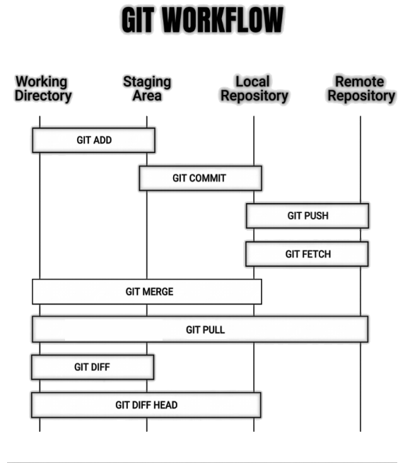

# Handy Commands
Schema and workflow for the lazy  

- `git init`  
  Create an empty repository
- `git add`  
  Add changes from the working directory into the staging area
- `git commit`  
  Save a snapshot of currently staged changes in the local repository
- `git push`  
  Upload commited changes from the local repository to a remote repository
- `git fetch`  
  Download changes from a remote repository without applying them locally
- `git merge`  
  Combine changes from one branch into another
- `git pull`  
  Fetch and then merge changes from a remote repository into the local branch
- `git diff`  
  Show the changes not staged or commited yet
- `git diff HEAD`  
  Show changes between the current working directory and the latest commit
- `git status`  
  Show the current state of the working directory and staging area
- `git branch [-a]`  
  Show all local branches.
- `git checkout`  
  Create a branch or switch between branches
- `git log`  
  Show commits on the current branch with extra details
- `git stash`  
  Temporarily save uncommitted changes and apply them later
- `git rebase`  
  Apply commits from one branch to another
- `git reset [--hard]`  
  Undo changes in the working directory and move back to a specific commit
- `git revert`  
  Undo changes by creating a new commit
- `git cherry pick`  
  Apply commits from one branch to another
- `git bisect`  
  Narrow down bugs quickly

# Resources
- [How to Use Git Version Control System in Linux [Comprehensive Guide]](https://www.tecmint.com/use-git-version-control-system-in-linux/)
- [the simple guide/getting started (no deep shit)](http://rogerdudler.github.io/git-guide/)
- [A private GIT server crash course (HackADay)](https://hackaday.com/2018/06/27/keep-it-close-a-private-git-server-crash-course/)
- [Pro Git latest edition](https://github.com/progit) Best book ever: free, full of examples, friendly pdf and available on github naturally !
- [Git Commands Explained with Cats](https://girliemac.com/blog/2017/12/26/git-purr/). Cutest guide around. Everybody wants a guide for git with cats :)

# Links
- Setting Up the Server  
  https://git-scm.com/book/en/v2/Git-on-the-Server-Setting-Up-the-Server
- How to create and apply a patch with Git  
  https://www.devroom.io/2009/10/26/how-to-create-and-apply-a-patch-with-git/
- Working with multiple remote repositories  
  https://jigarius.com/blog/multiple-git-remote-repositories
- Download the changes contained in a Github pull request as a unified diff  
  https://stackoverflow.com/questions/6188591/download-github-pull-request-as-unified-diff

---

# github.com related resources
### `gitub push` error on command line after enabling 2FA auth
I was expecting some kind of error on command line after enabling 2 Factor Authentication (2FA) because `git push` doesn't care about it. Official github guide on this topic is reported as:
(https://help.github.com/en/github/authenticating-to-github/creating-a-personal-access-token-for-the-command-line).
This solution suggests using access tokens as preferred way to solve it, sounds nice and easy to me.
